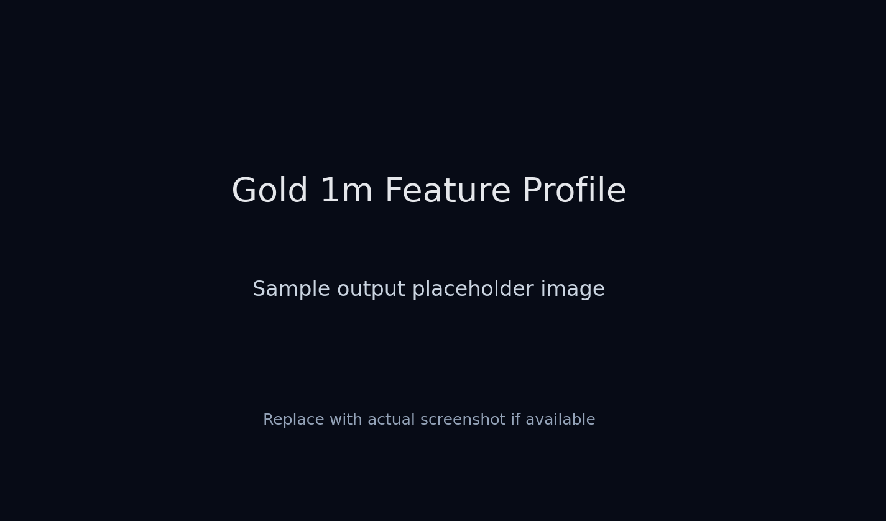

# crypto-market-loader

Production-grade ingestion and transformation pipeline for Deribit market data with bronze/silver/gold parquet layers.



## Overview

`crypto-market-loader` is designed for deterministic market data ingestion, incremental bronze/silver/gold feature engineering, and clean dataset artifacts for downstream modeling.

Supported domains:
- Exchange: `deribit`
- Markets: `spot`, `perp`, `oi`, `funding`
- Symbols: `BTC`, `ETH`, `SOL`
- Storage: parquet lake with manifest and plot sidecars

Design principles:
- reproducible, incremental pipeline runs
- strong schema boundaries and typed service layers
- idempotent persistence and safe operational defaults
- explicit bronze/silver/gold medallion separation

## Quick start

Install and activate a virtual environment:

```bash
python -m venv .venv
source .venv/bin/activate
pip install -U pip
pip install -e '.[dev]'
```

Run a sample bronze ingestion:

```bash
python3 main.py bronze-build \
  --exchange deribit \
  --market spot perp oi funding \
  --symbols BTC ETH SOL \
  --save-parquet-lake \
  --lake-root lake/bronze
```

Run a silver transform:

```bash
python3 main.py silver-build \
  --bronze-root lake/bronze \
  --silver-root lake/silver \
  --exchange deribit \
  --market spot perp oi funding \
  --timeframe 1m
```

Run a gold build:

```bash
python3 main.py gold-build \
  --silver-root lake/silver \
  --gold-root lake/gold \
  --exchange deribit
```

## Repository layout

```text
api/
application/
ingestion/
docs/
tests/
README.md
REPORT.md
AGENTS.md
```

## Configuration

Runtime configuration is mandatory via `config.yaml`.

- `config.yaml` is the canonical runtime config source
- do not use `.env` for runtime configuration
- keep permissions restrictive: `chmod 600 config.yaml`

CLI flags override configuration defaults.

## Bronze layer

Bronze stores raw source records and does not engineer features.

Command example:

```bash
python3 main.py bronze-build --exchange deribit --market spot perp oi funding --symbols BTC ETH SOL --save-parquet-lake --lake-root lake/bronze
```

Key Bronze semantics:
- `spot` and `perp` are 1-minute OHLCV candles
- `oi` and `funding` preserve native source event timestamps
- incremental ingestion with tail-first and gap-fill behavior
- optional start-date overrides are configurable via `config.yaml`

Bronze output layout:

```text
dataset_type=spot|perp|oi|funding/
  exchange=<exchange>/instrument_type=<spot|perp>/symbol=<symbol>/timeframe=<interval>/year=<YYYY>/month=<YYYY-MM>/date=<YYYY-MM-DD>/data.parquet
```

## Silver layer

Silver builds monthly feature artifacts and optional sidecars.

Command examples:

```bash
python3 main.py silver-build --bronze-root lake/bronze --silver-root lake/silver --exchange deribit --market spot perp oi funding --timeframe 1m
python3 main.py silver-build --bronze-root lake/bronze --silver-root lake/silver --exchange deribit --market spot perp oi funding --timeframe 1m --manifest --plot
```

Silver outputs:

```text
dataset_type=<spot|perp>/
  exchange=<exchange>/symbol=<symbol>/timeframe=1m/year=<YYYY>/month=<YYYY-MM>/<SYMBOL>-<YYYY-MM>.parquet

dataset_type=funding_observed/
  exchange=<exchange>/symbol=<symbol>/timeframe=8h/year=<YYYY>/month=<YYYY-MM>/<SYMBOL>-<YYYY-MM>.parquet

dataset_type=funding_1m_feature/
  exchange=<exchange>/symbol=<symbol>/timeframe=1m/year=<YYYY>/month=<YYYY-MM>/<SYMBOL>-<YYYY-MM>.parquet

dataset_type=oi_observed/
  exchange=<exchange>/symbol=<symbol>/timeframe=1m/year=<YYYY>/month=<YYYY-MM>/<SYMBOL>-<YYYY-MM>.parquet

dataset_type=oi_1m_feature/
  exchange=<exchange>/symbol=<symbol>/timeframe=1m/year=<YYYY>/month=<YYYY-MM>/<SYMBOL>-<YYYY-MM>.parquet
```

Silver sidecars:
- `--manifest` writes monthly JSON sidecars next to parquet
- `--plot` writes monthly PNG plot sidecars next to parquet
- silver manifests include contract metadata, feature hashes, and provenance

## Gold layer

Gold joins silver features onto a canonical 1-minute grid and produces final dataset artifacts.

Command examples:

```bash
python3 main.py gold-build --silver-root lake/silver --gold-root lake/gold --exchange deribit
python3 main.py gold-build --silver-root lake/silver --gold-root lake/gold --exchange deribit --symbols BTC ETH SOL
python3 main.py gold-build --silver-root lake/silver --gold-root lake/gold --exchange deribit --dataset-id gold.market.full.m1 --dataset-version v1.0.0
python3 main.py gold-build --silver-root lake/silver --gold-root lake/gold --exchange deribit --dataset-id gold.hybrid.full_l2.m1 --l2-root remote_l2_m1_features --l2-validation-mode lenient
```

Supported dataset IDs:
- `gold.market.core.m1`
- `gold.market.core_funding.m1`
- `gold.market.full.m1`
- `gold.hybrid.full_l2.m1`

Gold dataset summary:

| Dataset ID | Includes | Feature families |
|---|---|---|
| `gold.market.core.m1` | `spot`, `perp` | core candle fields |
| `gold.market.core_funding.m1` | `spot`, `perp`, `funding_1m_feature` | funding carry state and last-known funding |
| `gold.market.full.m1` | `spot`, `perp`, `oi_1m_feature`, `funding_1m_feature` | full market, funding, and position features |
| `gold.hybrid.full_l2.m1` | full dataset + L2 | gold market features plus latest L2 feature fields |

Gold outputs:

```text
lake/gold/dataset_id=<dataset_id>/dataset_type=gold_symbol_dataset/feature_set_version=<dataset_version>/exchange=<exchange>/symbol=<symbol>/<SYMBOL>_GOLD_<featurehash>_<sourcehash>.parquet
lake/gold/dataset_id=<dataset_id>/dataset_type=gold_symbol_dataset/feature_set_version=<dataset_version>/exchange=<exchange>/symbol=<symbol>/<SYMBOL>_GOLD_<featurehash>_<sourcehash>.json
lake/gold/dataset_id=<dataset_id>/dataset_type=gold_symbol_dataset/feature_set_version=<dataset_version>/exchange=<exchange>/symbol=<symbol>/<SYMBOL>_GOLD_<featurehash>_<sourcehash>.png
```

Gold notes:
- `.json` manifest and `.png` plot are generated for every gold artifact
- gold is always built on a canonical 1-minute time grid
- missing source minutes are preserved as nulls instead of dropped
- gold plots are capped to `3000` evenly sampled points for performance

## Feature profile example

The plot above illustrates the gold dataset profile output, including feature distributions and time-series summaries for each numeric field.

## Testing & validation

Run the targeted test suite:

```bash
python -m pytest tests/test_gold_service.py -q
```

Run full repository tests:

```bash
python -m pytest -q
```

## Notes

- `config.yaml` must exist before runtime
- the pipeline is designed for repeatable monthly parity schema artifacts
- use the CLI help output for command-specific options:

```bash
python3 main.py --help
```
